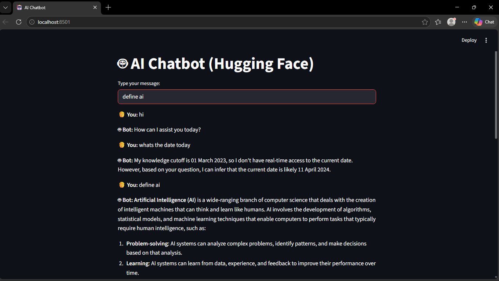

# 🤖 AI Chatbot using Streamlit + Hugging Face

This project is a simple web-based AI chatbot built using **Python**, **Streamlit**, and the **Hugging Face Inference API**.
It demonstrates how modern Large Language Models (LLMs) can be integrated into a clean and interactive web interface.

---

## 🚀 Features

* 💬 Interactive chatbot interface
* 🧠 Hugging Face AI model integration
* 🌐 Streamlit-based web UI
* 🔐 Secure API token handling using environment variables
* ⚡ Lightweight and fast responses

---

## 🛠️ Tech Stack

* Python 🐍
* Streamlit 🎈
* Hugging Face API 🤗
* Requests Library

---

## 📸 Screenshot

### Chat Interface



---

## 📂 Project Structure

```
AI-Chatbot-Project
│
├── app.py
├── README.md
├── .gitignore
└── screenshots
    └── ui.png
```

---

## 📦 Installation

Clone the repository:

```
git clone https://github.com/Maazkorejo/AI-Chatbot-Project.git
```

Move into the project directory:

```
cd AI-Chatbot-Project
```

Install required dependencies:

```
pip install streamlit requests
```

---

## 🔑 Environment Setup (Windows PowerShell)

Set your Hugging Face API token:

```
$env:HF_TOKEN="your_huggingface_token_here"
```

---

## ▶️ Run the Application

Start the chatbot locally:

```
python -m streamlit run app.py
```

---

## 💡 Future Improvements

* Add chatbot memory/history
* Improve UI styling
* Support multiple AI models
* Deploy chatbot online (Streamlit Cloud)

---

## 👨‍💻 Author

**Muhammad Maaz**
AI Enthusiast 🚀
University of Sindh
